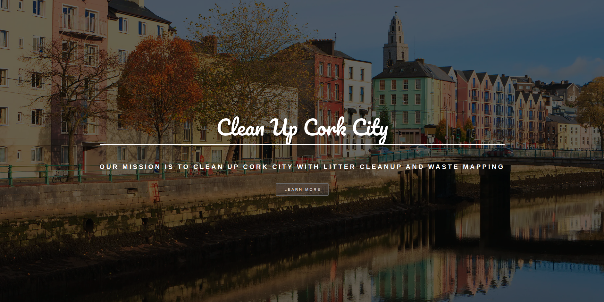
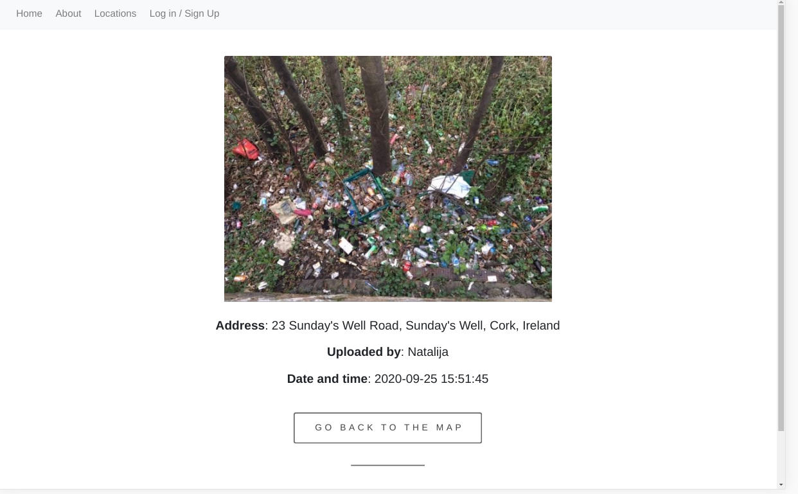
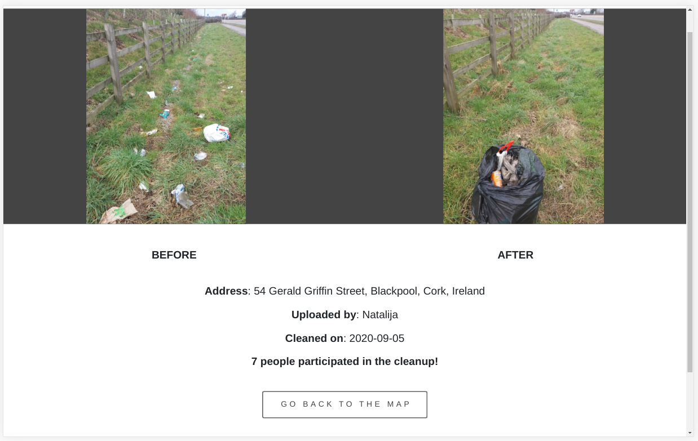
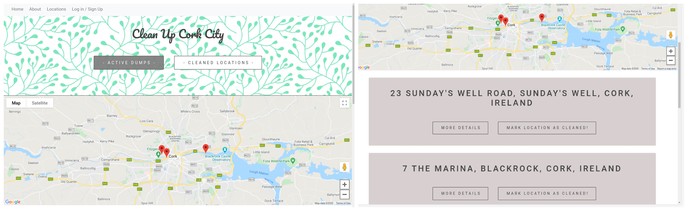
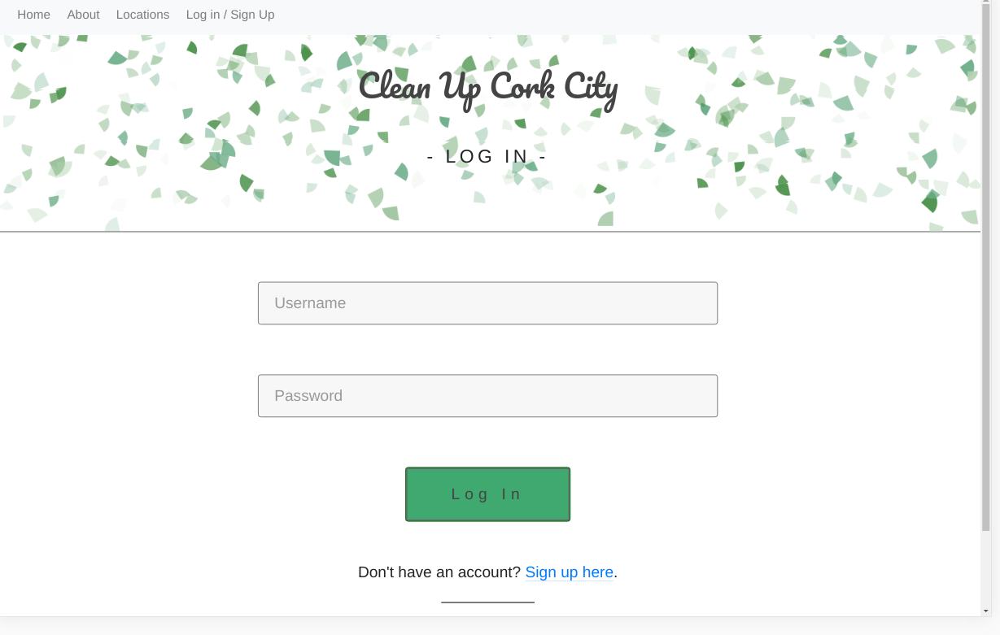
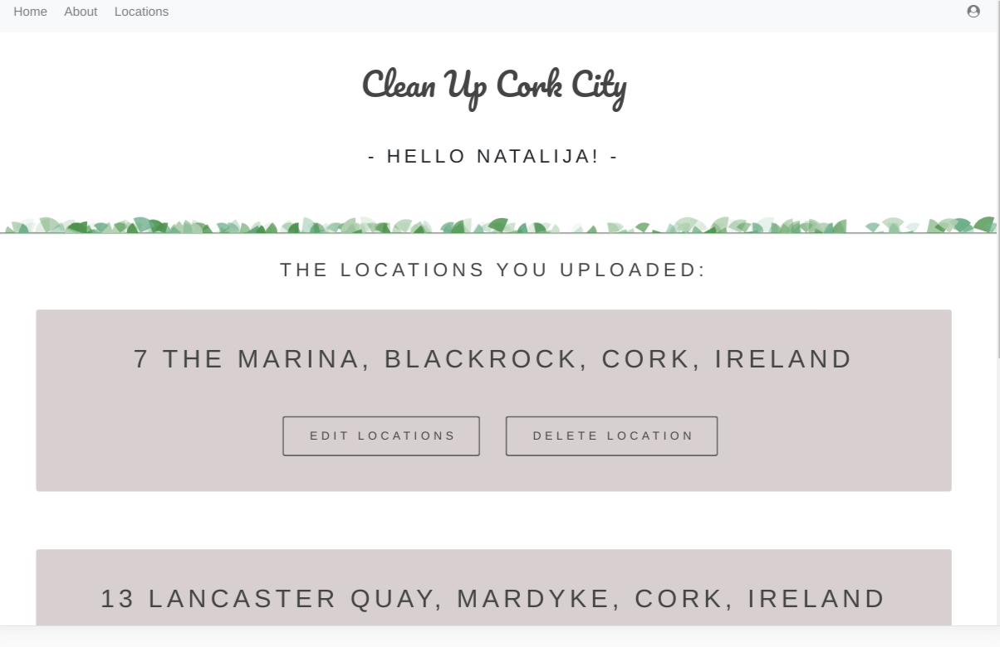
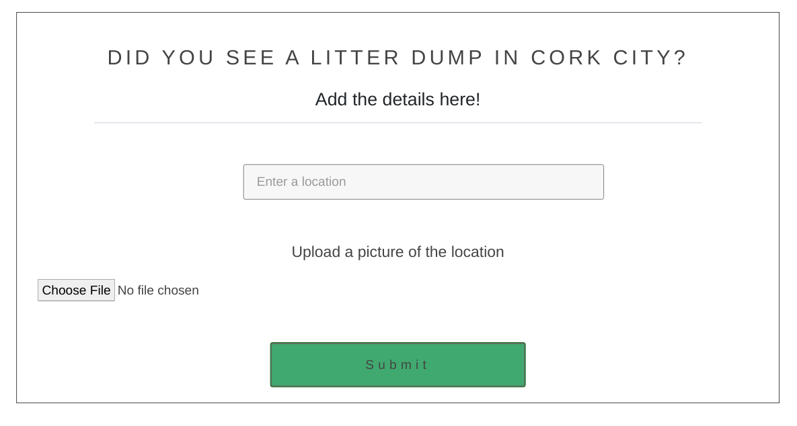

View the project on Heroku [here](https://cleanupcork.herokuapp.com/)

# Overview

## Purpose of the application
Littering is an ever-increasing worldwide problem. Chances are, you’ve seen litter scattered along roadsides, floating in waterways, or blowing across a parking lot. The well-being of people, animals, and the environment is compromised by litter. 

**Clean up Cork City** is a community-driven app that will allow people to create a map of litter dumps around Cork City. People can register on the website and add details about a location in the city that is polluted with litter. Events are organised for the volunteers who will come to one of the locations and clean up the litter.

## How does it work?
Users can search the **Clean up Cork City** database upon their first use of the application. No registration is necessary to search and view the location details. 

Users who are interested can sign up and contribute to the map. The user will be able to add new locations, as well as mark them as clean. The locations that the user uploaded are saved on the user's profile page and can be edited or deleted easily.

# Features
The following are the features provided in the **Clean up Cork City**  application. 

## Navigation bar and Footer
* Each page features a **navigation bar** that takes two shapes depending on if the user is logged in or not. If the user is not logged the navbar includes Home, About, Locations and Log in/Sign up links.

    If the user is logged in, the Log in button disappears and a profile icon appears that redirect users to their profile.

    On a screen size smaller than a tablet the navbar becomes a collapsible element. 

* Each page features **social media links**  at the bottom. They redirect a user to the social media platform opening it in a new window. The footer remains the same, not depending on the user being logged in or not.

## Home & About page
* Users can learn about the purpose of the site on the Home and About page.

## Locations
* The locations are sorted in 2 categories - active and cleaned.
* **Active locations** represent all the locations that are still not cleaned. A user can see details of each location - address, location picture, who uploaded it and when.

    

* **Cleaned locations** represent all the locations that have been cleaned. A user can see details of each location - address, picture of the location before and after the cleanup, the name of the user who edited it, when was it cleaned and how many people participated in the cleanup.

    

* With both lists there is a  **map** showing the locations. The map contains markers representing the locations. When clicked the markers show an info window with the address of the location. When users click on the info window they are redirected to the location on the list.

    

## User Login and Registration
* Registering users are asked to create a username, provide an email address, date of birth and home address.
* Users have to log in in order to contribute to the map of locations.

    

## User Profile
* Users profile page contains a list of all the locations the user uploaded, with an option to edit or delete them.

    

* There is an event section on the profile that contains a list of all future events.

    

* Option to log out.
 

## Adding locations
* Users who are logged in can add a location or mark an existing location as cleaned.  
* The location is validated to make sure it doesn't already exist in the database and that it is an actual address in Cork City.

    

## Features Left to Implement
* The possibility for registered users to edit their details, such as password or username.
* Email authentification.

# Wireframes

1. Home:
- [Desktop](static/images/readme_images/wireframe_home.png)
- [Tablet](static/images/readme_images/wireframe_home_tablet.png)
- [Mobile](static/images/readme_images/wireframe_home_mobile.png)

2. Locations:
- [Desktop](static/images/readme_images/wireframe_locations.png)
- [Tablet](static/images/readme_images/wireframe_locations_tablet.png)
- [Mobile](static/images/readme_images/wireframes_locations_mobile.jpg)

# Site Users 
### Who is the site focused on?
1. People who want to help their community become litter free and a safer place to live.
2. People who are worried about the animal and wildlife wellbeing.
3. People who are environmentally conscious.

### The following user stories were used to design the website:
1. Anna, “In my free time I love walking next to the River Lee, but I have noticed there is more and more trash around the walking paths. I think it's a big problem, not just for the wildlife living by the river but for us people as well. I would like to do something about it but don't know where to report this problem.”

2. Chris, “I go for a walk with my dogs every Sunday on the outskirts of Cork but lately I have been reluctant to let them off the leash because there are so many places where people throw waste and rubbish and I am worried they will eat something that will make them sick. I think litter is a big problem in Cork and I would love to do something about it but I don't know where to start or what to do”

3. Moira, “I haven't been to the local park for ages because it has become a place where people drink and leave empty bottles and rubbish. I heard some people tried to clean it up but don't know if they managed to do it.”

# Testing
Testing information can be found in the separate testing file that can be accessed [here](https://github.com/trisdauvergne/milestone-project-03/blob/00d1baa9a31a3c0238660b9be2836eee7824d2c7/TESTING.md).

# Database Organisation
Database information can be found in the separate file that can be accessed [here](https://github.com/trisdauvergne/milestone-project-03/blob/master/readme_assets/readme_images/wt_data_structure.jpg).

# Technologies 

## Languages

* HTML5
* CSS3
* JavaScript  
* Python (3.6)

## Libraries, frameworks and API's
- [BootStrap4](https://getbootstrap.com/docs/4.0/getting-started/introduction/) to assist with the structuring and responsiveness of the site
- [JQuery](https://jquery.com/) for DOM manipulation.
- [Fontawesome (4.7.0)](https://fontawesome.com/v4.7.0/) library for custom icons
- [Flask](https://pypi.org/project/Flask/) framework to build the web application
- [Flask-Pymongo](https://pypi.org/project/Flask-PyMongo/) library to connect to the MongoDB database from the web application
- [Geocomplete] (http://ubilabs.github.io/geocomplete/?utm_source=cdnjs&utm_medium=cdnjs_link&utm_campaign=cdnjs_library) - jQuery Geocoding and Places Autocomplete Plugin
- [GeoPy](https://geopy.readthedocs.io/en/stable/) for coordinates of addresses.
- [Google Fonts](https://fonts.google.com/) for the fonts used throughout the page
- [Google Maps](https://cloud.google.com/maps-platform) - geo-location API
- [Jinja](https://jinja.palletsprojects.com/en/2.11.x/)

## Hosting and deployment 

- [Git](https://git-scm.com/) for version control
- [Github](https://github.com/) to store repositories of the project
- [Heroku](https://www.heroku.com/) for hosting the deployed app
- [MongoDB](https://account.mongodb.com/account/login?signedOut=true) for storing the database

# Deployment
This project has been pushed and deployed to the cloud application platform [Heroku](https://www.heroku.com/).

1. On Heroku create an account and log in.
2. Click `new` and `create new app`.
3. Choose a unique name for your app, select region and click on `Create App`
4. Under the `Settings` click `Reveal Config Vars` and set IP to 0.0.0.0 and the PORT to 5000
5. Go to the CLI and type `$ sudo snap install --classic heroku`
6. Type `$ heroku login` command into the terminal
7. Create `requirements.txt` ($ sudo pip3 freeze --local > requirements.txt)
8. Create a `Procfile` (`$ echo web: python app.py > Procfile`)
9. Go back to Heroku, under `Deploy` find `Existing Git repository` and copy the command:`$ heroku git:remote -a <app_name>` Paste this into the terminal.
10. (If repository was not created already, type:
11. `$ cd my-project/`
12. `$ git init`
13. `$ heroku git:remote -a <app_name>`)
14. Type `$ heroku ps:scale web=1` into the terminal.
15. Go back to Heroku, and at `Settings` copy `https://<app_name>.herokuapp.com/` 
16. In the terminal type `git remote add http://<app_name>.herokuapp.com/`
16. Type `git push -u heroku master`
17. In the app dashboard, under `Settings` click on `Reveal Config Vars`
21. Set "MONGO_URI" and "MONGO_DBNAME" and "SECRET_KEY"
22. Once the build is complete, go back to Heroku and click on `Open App`

## Credits
### Code 
* [TEMPLATED](https://templated.co/epilogue): CSS, HTML5 & Responsive site template Epilogue by TEMPLATED used throughout the project: index.html basic design, buttons, footer.
* [ Pretty Printed](https://www.youtube.com/watch?v=DsgAuceHha4): a tutorial on Save and Retrieve Files In a MongoDB With Flask-Pymongo.
* [Confetti animation](https://codemyui.com/confetti-falling-background-using-canvas/): The code from codemyui.com was used to create the confetti animation.
* Example code to retain the scroll position of a scrollable area when pressing the back button found on Stack Overflow - [link](https://stackoverflow.com/questions/29203312/how-can-i-retain-the-scroll-position-of-a-scrollable-area-when-pressing-back-but)
* Example code to create a list that contains the dates of all the Saturdays starting from today found on Stack Overflow - [link](https://stackoverflow.com/questions/20898661/how-to-get-saturdays-and-sundays-dates-of-a-month-javascript)

### Content
* The idea for this website came from an amazing project [World cleanup day](https://www.worldcleanupday.org/)

### Media
* Images were taken from freely-usable source Pexels:
    1. litter.jpg - Photo by Catherine Sheila from Pexels.
    2. plastic.jpeg - Photo by Magda Ehlers from Pexels.
    3. volunteers.jpeg - Photo by Belle Co from Pexels.

* cork.jpg - Image found [here](https://lp-cms-production.imgix.net/2019-06/GettyImages-153020210_medium.jpg?fit=crop&q=40&sharp=10&vib=20&auto=format&ixlib=react-8.6.4)
* map.jpg - Image found [here](https://www.exchangewire.com/wp-content/uploads/2016/02/Location.jpg)

* Animation Illustration GIF By Jessica Riccardi found [here](https://giphy.com/gifs/cool-green-26DOxTG4DabtkUssE?utm_source=media-link&utm_medium=landing&utm_campaign=Media%20Links&utm_term=)

## Acknowledgments
I would like to thank my mentor Brian Macharia for his advice and help with this project.

