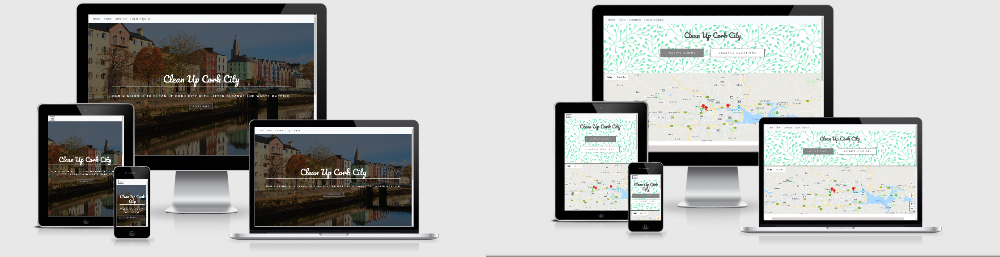

# Testing
- HTML validated using [W3C Validator](https://validator.w3.org/) 
- CSS validated using [W3C CSS Validator](https://jigsaw.w3.org/css-validator/) 
- Python validated using [PEP8 online check](http://pep8online.com/)
- JavaScript validated using [W3C Validator](https://validator.w3.org/) 

## Testing user stories from the README.md

1. _“In my free time I love walking next to the river Lee, but I have noticed there is more and more trash around the walking paths. I thinks it's a big problem, not just for the wildlife living by the river but for us people as well. I would like to do something about it but don't know where to report this problem.”_

    This user can: _Click **Learn more** on the welcome page > Click **About Us**, learn about the option to sign up and add a location that will be cleaned up > Go to **Sign up** > On the profile page click **Add a location** > Fill in and submit the form_

2. _“I go for a walk with my dogs every Sunday on the outskirts of Cork but lately I have been reluctant to let them of the leash because there is so many places where people throw waste and rubbish and I am worried they will eat something that will make them sick. I think litter is a big problem in Cork and I would love to do something about it but I don't know where to start or what to do.”_
  
    This user can: _Click **Learn more** on the welcome page > Click **About Us**, learn about the option to participate in the clean up event > Go to **Sign up** > On the profile page click **Events** and see where he can join and help cleanup a location

3. _“I haven't been to the local park for ages because it has become a place where people drink and leave empty bottels and rubish. I heared some people tried to clean it up but don't know if they managed to do it.”_
 
    This user can: _Click **Learn more** on the welcome page > Click **Map of waste**> Go to **Cleaned locations** and see if the location she was interested in was cleaned up.

## Manual testing 
**Test:** Visit site and find the purpose of the site.  
**Expected Outcome:** When the site is opened, there is the heading with the messag and a button Learn more. When the button is clicked, the user is redirected to the bottom of the page with two sections explaining the purpose of the site   
**Passed:** Yes  

**Test:** Create new account and log in to it.  
**Expected Outcome:** Sign up form displays correctly and once submitted it is possible to log in.  
**Passed:** Yes  

**Test:**  Add a new location.  
**Expected Outcome:** Form for adding a location displays corectly 
and after the user submits the form, the location appears on the 
list and the map.  
**Passed:** Yes.

**Test:** Edit a location.  
**Expected Outcome:** On the profile page, the user can edit the location that he/she uploaded. 
**Passed:** Yes  

**Test:** Delete a location.  
**Expected Outcome:** On the profile page, the user can delete the location that he/she uploaded.  
**Passed:** Yes  

**Test:** Adding an adress that is not valid or is outside Cork City. 
**Expected Outcome:** Adding an adress that is not valid or is outside Cork City raises an error.  
**Passed:** Yes  
 
**Test:** Sign out.  
**Expected Outcome:**  Session cookie is cleared and no account is logged in.   
**Passed:** Yes  

## Responsiveness test
The website was viewed on a variety of devices such as Desktop, Laptop, iPhone, Samsung and Motorola.

## Further testing:

1. A large amount of testing was done to ensure that all pages were linking correctly.
2. Friends and family members were asked to review the site and documentation to point out any bugs and/or user experience issues.
