# Testing
- [W3C Markup Validator](https://validator.w3.org/) - [Result](https://validator.w3.org/nu/?doc=https%3A%2F%2Fcleanupcork.herokuapp.com%2F)
- [W3C CSS Validator](https://jigsaw.w3.org/css-validator/) - [Results](https://jigsaw.w3.org/css-validator/validator?uri=https%3A%2F%2Fcleanupcork.herokuapp.com%2F&profile=css3svg&usermedium=all&warning=1&vextwarning=&lang=en)
- [PEP8 online check](http://pep8online.com/) - [Result]
- [JSHint](https://jshint.com/) - JavaScript code passed through a linter with no major issues.

## Testing user stories from the README.md

1. _“In my free time, I love walking next to the River Lee, but I have noticed there is more and more trash around the walking paths. I think it's a big problem, not just for the wildlife living by the river but for us people as well. I would like to do something about it but don't know where to report this problem.”_

    This user can: _Click **Learn more** on the welcome page > Click **About Us**, learn about the option to sign up and add a location that will be cleaned up > Go to **Sign up** > On the profile page click **Add a location** > Fill in and submit the form_

2. _“I go for a walk with my dogs every Sunday on the outskirts of Cork but lately I have been reluctant to let them off the leash because there are so many places where people throw waste and rubbish and I am worried they will eat something that will make them sick. I think litter is a big problem in Cork and I would love to do something about it but I don't know where to start or what to do.”_
  
    This user can: _Click **Learn more** on the welcome page > Click **About Us**, learn about the option to participate in the cleanup event > Go to **Sign up** > On the profile page click **Events** and see where he can join and help clean up a location

3. _“I haven't been to the local park for ages because it has become a place where people drink and leave empty bottles and rubbish. I heard some people tried to clean it up but don't know if they managed to do it.”_
 
    This user can: _Click **Learn more** on the welcome page > Click **Map of waste**> Go to **Cleaned locations** and see if the location she was interested in was cleaned up.

## Manual testing 
**Test:** Visit the website and find its purpose.  
**Expected Outcome:** When the site is opened, there is the heading with the message and a button Learn more. When the button is clicked, the user is redirected to the bottom of the page with two sections explaining the purpose of the site   
**Passed:** Yes

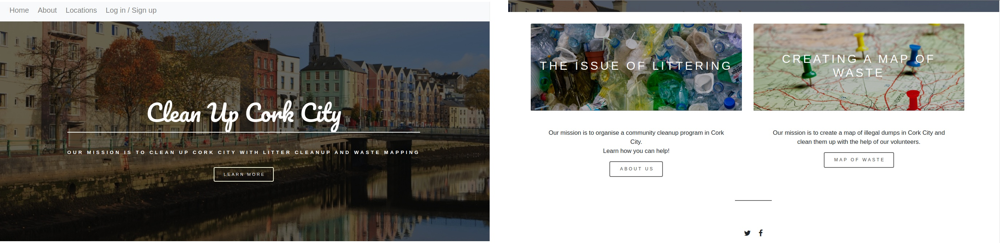  

&nbsp;

**Test:** Create a new account and log in to it.  
**Expected Outcome:** Sign up form displays correctly and once submitted it is possible to log in.  
**Passed:** Yes 

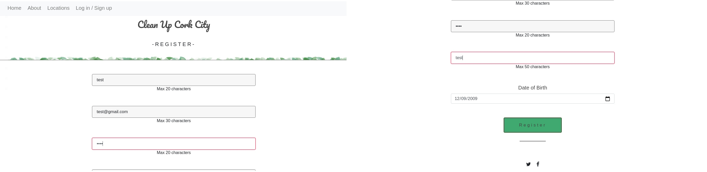 

&nbsp;

**Test:**  Add a new location.  
**Expected Outcome:** Form for adding a location displays correctly 
and after the user submits the form, the location appears on the 
list and the map.  
**Passed:** Yes.

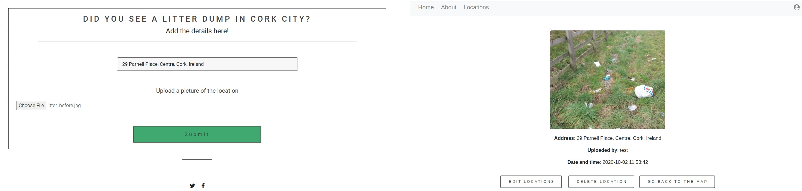 

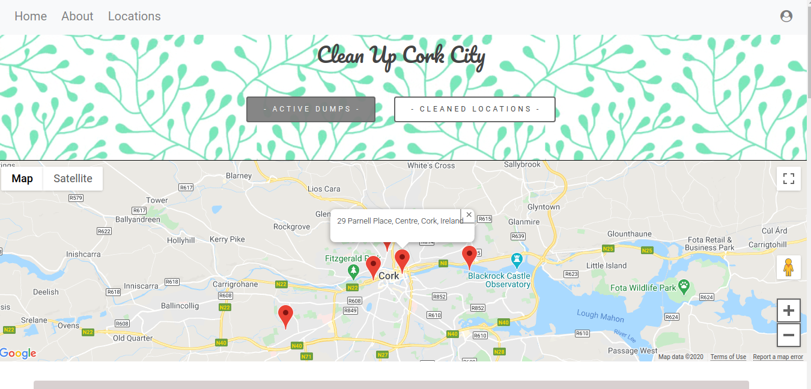 

&nbsp;

**Test:** Edit a location.  
**Expected Outcome:** On the profile page, the user can edit the location that he/she uploaded. 
**Passed:** Yes 

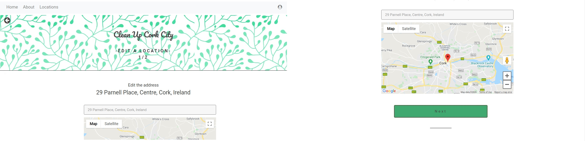 
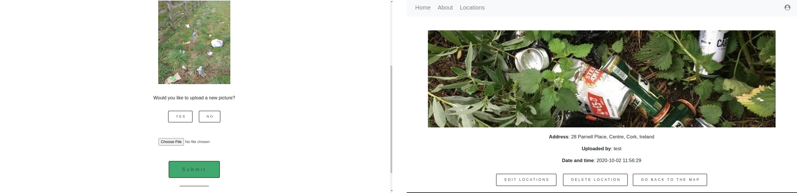 

&nbsp;

**Test:** Delete a location.  
**Expected Outcome:** On the profile page, the user can delete the location that he/she uploaded.  
**Passed:** Yes  

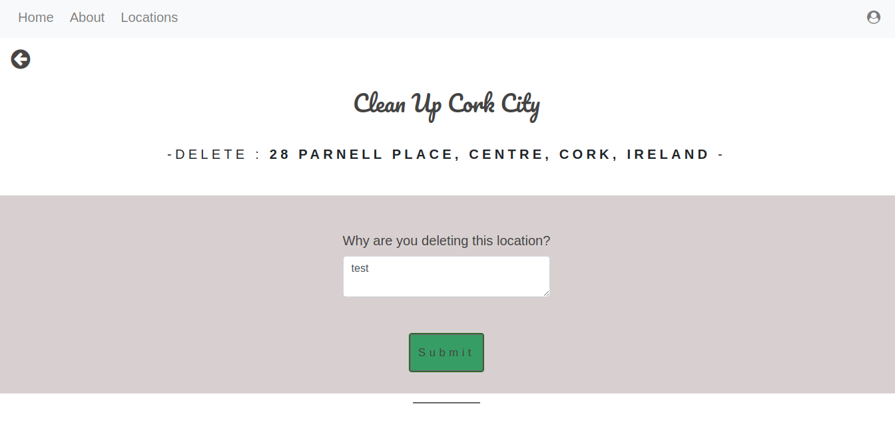 

&nbsp;

**Test:** Sign out.  
**Expected Outcome:**  A session cookie is cleared and no account is logged in.   
**Passed:** Yes 

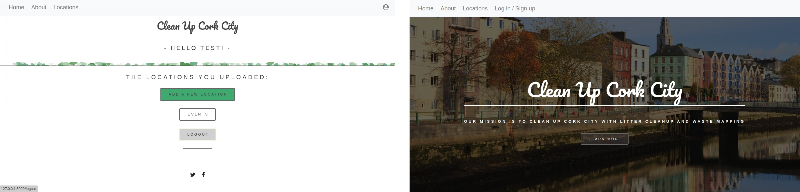 

&nbsp;

**Test:** Try to register with a date of birth outside 1/1/1920 - 1/1/2010.  
**Expected Outcome:** Adding a date of birth that is not between 1/1/1920 and 1/1/2010 raises an error.  
**Passed:** Yes 

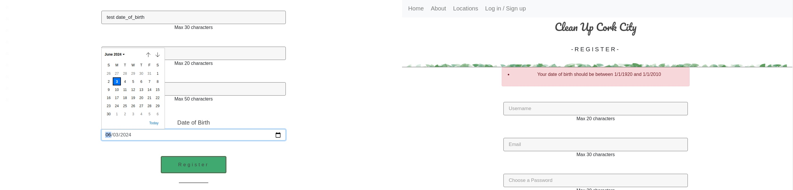 

&nbsp;

**Test:** Try to register with an empty username input field.  
**Expected Outcome:** An empty username input field raises an error.  
**Passed:** Yes 

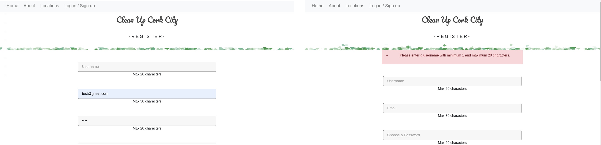 

&nbsp;

**Test:** Try to register with a username that already exists.   
**Expected Outcome:** Registering with a username that already exists raises an error.  
**Passed:** Yes 

 

&nbsp;

**Test:** Try to log in with incorrect password.   
**Expected Outcome:** Logging in with an incorrect password raises an error.  
**Passed:** Yes 

 

&nbsp;

**Test:** Adding an address that is not valid.  
**Expected Outcome:** Adding an address that is not valid raises an error.  
**Passed:** Yes  

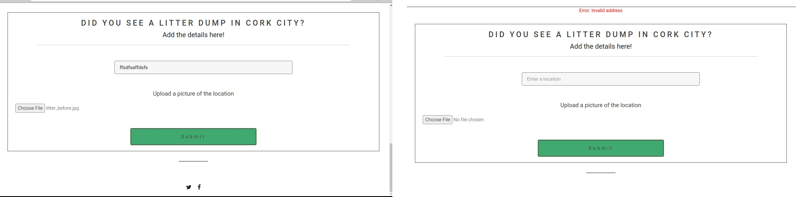 

&nbsp;

**Test:** Adding an address that is outside Cork City.  
**Expected Outcome:** Adding an address that is outside Cork City raises an error.  
**Passed:** Yes 

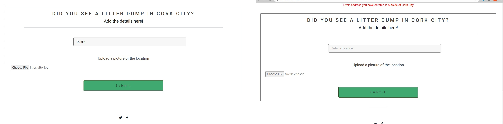 

&nbsp;

**Test:** Adding an address that already exists in the database.  
**Expected Outcome:** Adding an address that already exists in the database raises an error.  
**Passed:** Yes  

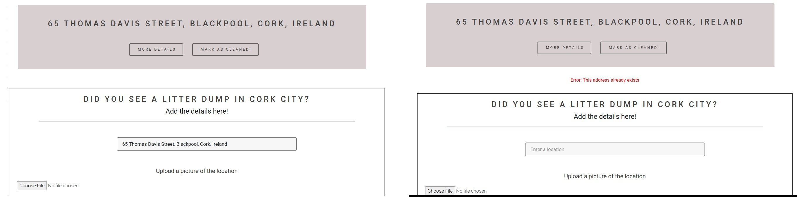 

&nbsp;

**Test:** Try marking a location was cleaned on an invalid date.  
**Expected Outcome:** Marking a location as cleaned on an invalid date raises an error.  
**Passed:** Yes

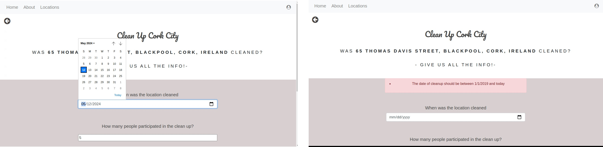 

&nbsp;

**Test:** Invalid location id.  
**Expected Outcome:** Invalid location id redirects to 404 page.  
**Passed:** Yes

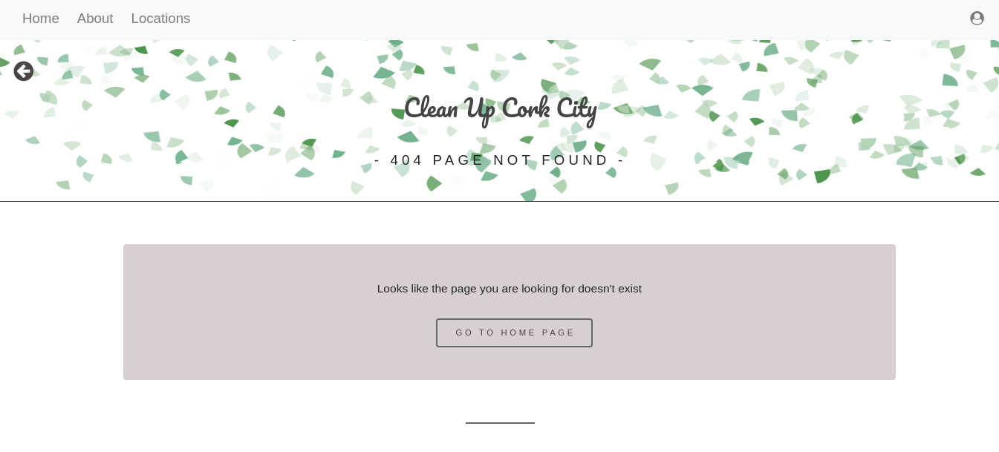 

&nbsp;

 
 
 

## Responsiveness test
The website was viewed on a variety of devices such as Desktop, Laptop, iPhone, Samsung and Motorola.

## Further testing:
1. A large amount of testing was done to ensure that all pages were linking correctly.
2. Friends and family members were asked to review the site and documentation to point out any bugs and/or user experience issues.
